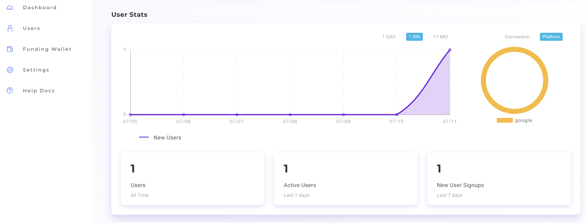

## Logging Users Out of the ORE ID Service

```text
📢 What this article covers: Quickly allow users to logout of your app.
```

In our last article we covered how to create a LoginPage React component.  Signing the user out of the ORE ID service will be tackled now.  Logging out the user is quick to implement.

1.  Create a new React component named LogoutUser.  The object returns the logout button.  The button calls the *```oreId.logout()```* function. 

```jsx
const LogoutUser = () => {
    return (
        <button
            onClick={() => {
                oreId.logout();
            }}
        >
            Logout
        </button>
    );
};
```

2.  Only thing left to do is call the new component within *```AppWithProvider```*.
```jsx
const AppWithProvider = () => {
    const isLoggedIn = useIsLoggedIn()
    return (
        <div>
            {isLoggedIn ? <LogoutUser /> : <LoginPage />}
        </div>
    );
}; 
```

If you’ve been following along with us, your app should be logging users in and out of the ORE ID service.  Check your user signups using the [developer dashboard](https://oreid.io/developer). 



Next article, blockchain transactions will be explored.  ORE ID is a multi-chain service supporting ALGO, WAX, EOS, ETH, TELOS, and POLYGON.  With many more chains planned for the near future.