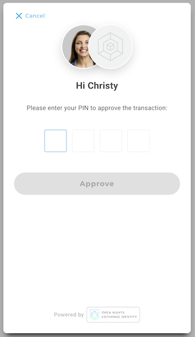

## Signing Transaction with ORE ID

```text
📢 What this article covers: Enable transaction signing in your app.
```

It’s time to add real blockchain functionality to our React application.  This will enable the webpopup to engage the user in a transaction signing flow.  

The user will be prompted to input their password/pin.  Then, ORE ID service will do the work by preparing and sending your transaction to the blockchain.  Returned, is the transaction's blockchain id and ORE ID service process id.  

This article will use Ethereum. But, later in the series, examples of other supported chains will be demo’d.  Let’s get started by creating a *SignTransaction.js* file.  This will hold the new React component being built in this article.

1. Import the dependencies of our new module.

```jsx
// SignTransaction.js

import { useState } from "react";
import { ChainNetwork } from "oreid-js";
import { useOreId, useUser } from "oreid-react";
```

2. Create the new React component named *SignTransaction*, declare the variables, and define the helper functions.  Return a button which we will hook up shortly.

```jsx
export const SignTransaction = () => {
    const oreId = useOreId();
    const user = useUser();
    const chainNetwork = ChainNetwork.EthRopsten;
    const[ txnId, setTxnId ] = useState("");
    const[ error, setError ] = useState("");

    const onError = ( error ) => {
        console.log("Transaction failed ", error);
        setError( error );
    };

    const onSuccess = ( result ) => {
        console.log( 
            "Transaction Successful. ", JSON.stringify(result)
        );
        setTxnId(result.transactionId)

    };

	return(
        <div>
            <button>
                Send Sample Transaction
            </button>
            {txnId && <div>Transaction Id: {txnId}</div>}
            {error && <div>Error: {error.message}</div>}
        </div>
    );
}
```

3. Next, create another function named *```handleSign()```.* This will contain the creation of the transaction and presentation of the webpopup. First, we need to know the user’s Ehereum Address to fill out the transaction. The logged in user’s Ethereum blockchain account is grabbed from the ORE ID service.  The function will return an error if a chainNetwork account can’t be found for that user.

```jsx
const handleSign = async () => {
    const signingAccount = user.chainAccounts.find(
        (ca) => ca.chainNetwork ===  chainNetwork
    );
    
    const errorMsg = `User doesn not have any accounts on ${chainNetwork}`;
    
    if (!signingAccount) {
        console.log( errorMsg );
        onError( errorMsg );
        return;
    };
}
```

4. *```handleSign()```* is appended with the transaction that is being pushed to the blockchain.  A JSON object named *```transactionBody```* will hold the details of a very simple transaction.  The transaction transfers zero value to yourself.  This is done to test the transaction ability.

```jsx
        const transactionBody = {
            from: signingAccount.chainAccount,
            to: signingAccount.chainAccount,
            value: 0
        };
```

5. While still building out the *```handleSign()```* function, it is now time to build the full transaction that will be signed by the user and sent to the blockchain.   The oreId instence calls the *``createTransaction()``* function and passes it the necessary pparameters.  We are returned a transaction object.

```jsx
        const transaction = await oreId.createTransaction({
            chainAccount: signingAccount.chainAccount,
            chainNetwork: signingAccount.chainNetwork,
            //@ts-ignore
            transaction: transactionBody,
            signOptions: {
                broadcast: true,
                returnSignedTransaction: false,
            },
        });
```

6. To finish *```handleSign()```*, the oreId instance uses the webpopup plugin by calling *```oreId.webpopup.sign()```*.  This launches the webpopup and begins the transaction signing flow. 

```jsx
        oreId.popup
            .sign({ transaction })
            .then( onSuccess )
            .catch( onError );
```

7. Hook up the handleSign() function to onClick button.

```jsx
            <button
                onClick={() => {
                    handleSign()
                }}
            >
                Send Sample Transaction
            </button>
```


Test the transaction and you will be prompted to enter your password/pin.




Upon successful entry of password/pin, the transaction will be sent to the blockchain.  You will most likely be presented with an error.  This is becuase you currently do not have any funds in your account.  Use a Ropsten testnet faucet to add testnet funds to your chainNetwork account. Look above get the code to find your ethereum blockchain account.

### Troubleshooting

Whitelist Error:

```text
Error: sign_transaction_rejected&error_message=Permission active must be one of the whitelisted permissions. Or contract 0x0000000000000000000000000000000000000000 and action transfer must be whitelisted in App Registration.
```

Resources Error: